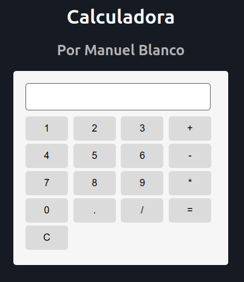

# Descripción del Repositorio
- Este repositorio contiene un pequeño proyecto de una calculadora que permite realizar operaciones aritmeticas basicas como sumar, restar, multiplicar y dividir.
- Para la realizacion de este proyecto se utilizaron las siguientes tecnologias:
  - [Html](https://developer.mozilla.org/es/docs/Web/HTML): Lenguaje de marcado para esrtuctura basica del proyecto en la web.
  - [Css](https://developer.mozilla.org/es/docs/Web/CSS): Lenguaje de estilos para dar presentacion al proyecto web.
  -  [Javascript](https://developer.mozilla.org/es/docs/Web/javascript): Lenguaje de programación para desarrollo de forntend y Backend.

## Imagen de la calculadora

